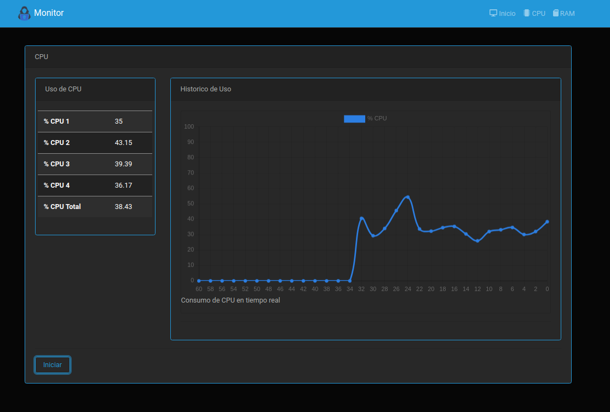
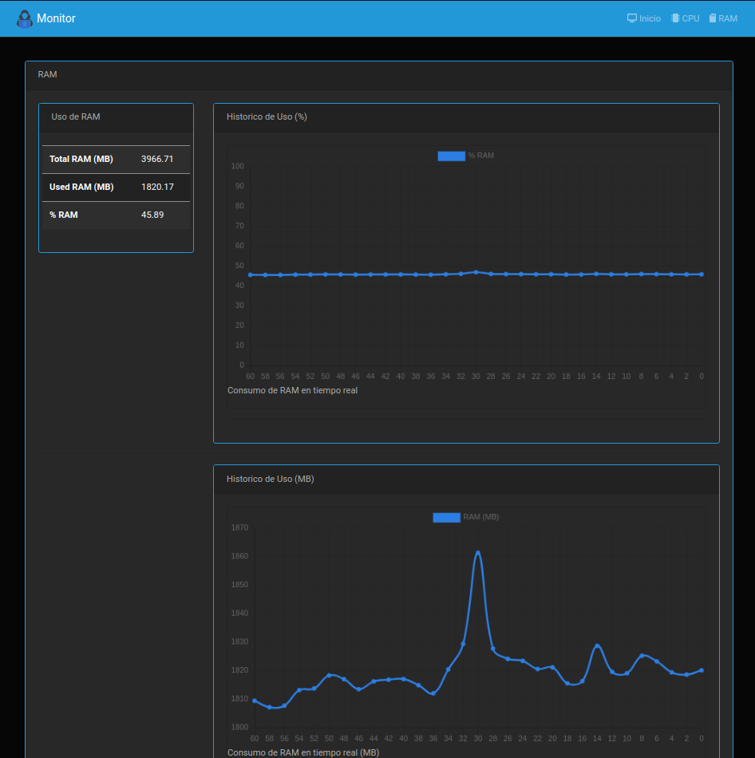
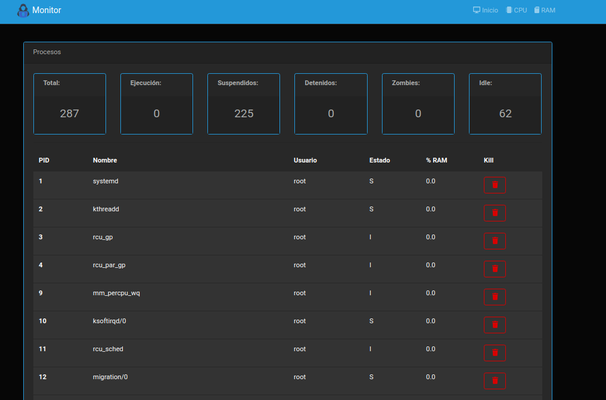

# Manual Técnico: Proyecto 1

---

---

### Luis Angel Vargas León

### Carné: 201701023

---

## Generación de Módulos:

### Módulo de CPU:

Por medio del archivo cpu_201701023.c se crea el modulo que obtiene los datos del cpu y procesos y los graba en un archivo .ko, el cual es insertado como modulo en la carpeta /proc.

El metodo test_init crea el archivo con el nombre "cpu_201701023" e imprime en el buffer del dmesg el mensaje "Luis Angel Vargas León", correspondiente al nombre del desarrollador, estos procesos ocurren al ejecutar el comando "insmod" sobre el archivo .ko generado con el Makefile.

```c
static int __init test_init(void)
{
    struct proc_dir_entry *entry;
    entry = proc_create("cpu_201701023", 0777, NULL, &my_fops);
    if (!entry)
    {
        return -1;
    }
    else
    {
        printk(KERN_INFO "Luis Angel Vargas León\n");
    }
    return 0;
}
```

Para configurar la accion tras utilizar el comando "rmmod" el cual desmonta el modulo, se utilizo la funcion test_exit:

```c
static void __exit test_exit(void)

{

remove_proc_entry("cpu_201701023", NULL);

printk(KERN_INFO "Diciembre 2020\n");

}
```

El Makefile que genera los archivos es el siguiente:

```c
obj-m += cpu_201701023.o
all:
	make -C /lib/modules/$(shell uname -r)/build M=$(PWD)
modulesclean:
	make -C /lib/modules/$(shell uname -r)/build M=$(PWD) clean
```

Las librerías utilizadas para obtener los datos del cpu y para el desarrollo son las siguientes:

```c
#include <linux/sched.h>
#include <linux/sched/signal.h>
#include <linux/module.h>
#include <linux/seq_file.h>
#include <linux/proc_fs.h>
#include <linux/kernel_stat.h>
#include <linux/tick.h>
```

La obtención de los procesos y el porcentaje de uso del CPU  se utilizo la funcion:

```c
static int my_proc_show(struct seq_file *m, void *v){}
```

Esta función obtiene todos los procesos, asi como el porcentaje de uso del CPU.

### Módulo de RAM:

Por medio del archivo memo_201701023.c se crea el modulo que obtiene los datos del consumo de la memoria RAM y los graba en un archivo .ko, el cual es insertado como modulo en la carpeta /proc.

El metodo test_init crea el archivo con el nombre "memo_201701023" e imprime en el buffer del dmesg el mensaje "201701023", correspondiente al carné del desarrollador, estos procesos ocurren al ejecutar el comando "insmod" sobre el archivo .ko generado con el Makefile.

```c
static int __init test_init(void)
{
    struct proc_dir_entry *entry;
    entry = proc_create("memo_201701023", 0777, NULL, &my_fops);
    if (!entry)
    {
        return -1;
    }
    else
    {
        printk(KERN_INFO "201701023\n");
    }
    return 0;
}
```

Para configurar la accion tras utilizar el comando "rmmod" el cual desmonta el modulo, se utilizo la funcion test_exit:

```c
static void __exit test_exit(void)
{
    remove_proc_entry("memo_201701023", NULL);
    printk(KERN_INFO "Sistemas Operativos 1\n");
}
```

El Makefile que genera los archivos es el siguiente:

```c
obj-m += memo_201701023.o
all:
	make -C /lib/modules/$(shell uname -r)/build M=$(PWD)
modulesclean:
	make -C /lib/modules/$(shell uname -r)/build M=$(PWD) clean
```

Las librerías utilizadas para obtener los datos del cpu y para el desarrollo son las siguientes:

```c
#include <linux/module.h>
#include <linux/proc_fs.h>
#include <linux/sysinfo.h>
#include <linux/seq_file.h>
#include <linux/mm.h>
```

El consumo de la RAM se obtiene especialmente de la librería sysinfo, de la cual se obtiene el método meminfo(), del cual se obtiene la memoria total y la memoria utilizada, todo esto se encuentra indicado en el método:

```c
static int my_proc_show(struct seq_file *m, void *v){}
```

## Interfaz Grafica:

Para observar los datos del consumo del CPU se puede consultar el endpoint /cpu de la interfaz de usuario:



Para observar los datos del consumo de la RAM se puede consultar el endpoint /ram de la interfaz de usuario:



Para observar los datos de los procesos, asi como terminarlos (kill) se puede consultar el endpoint /home de la interfaz de usuario:

